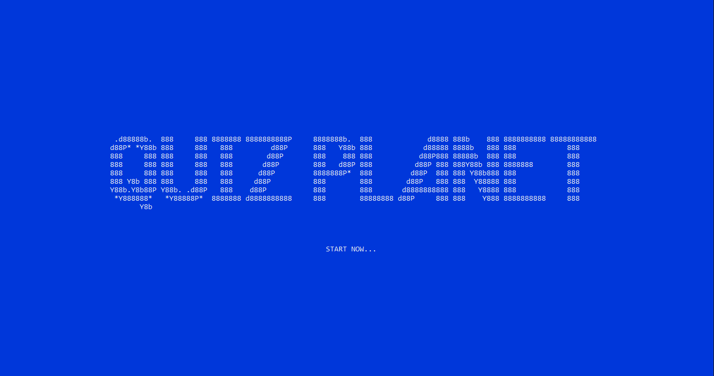
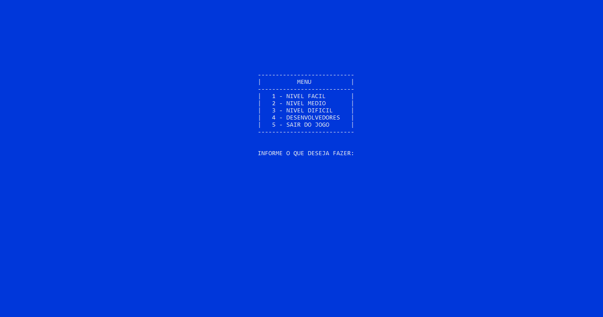
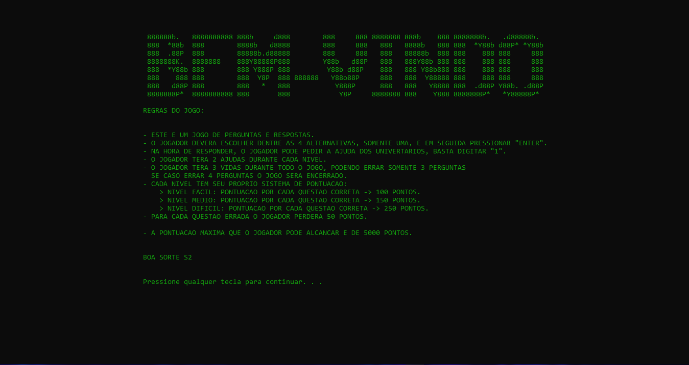
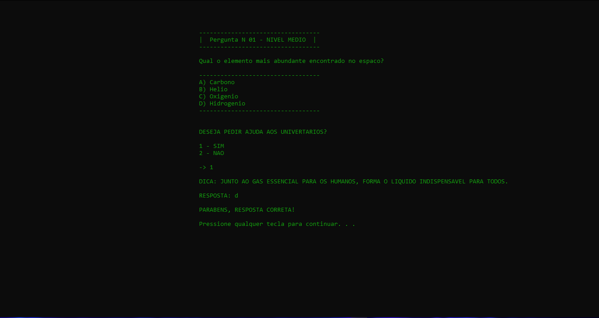
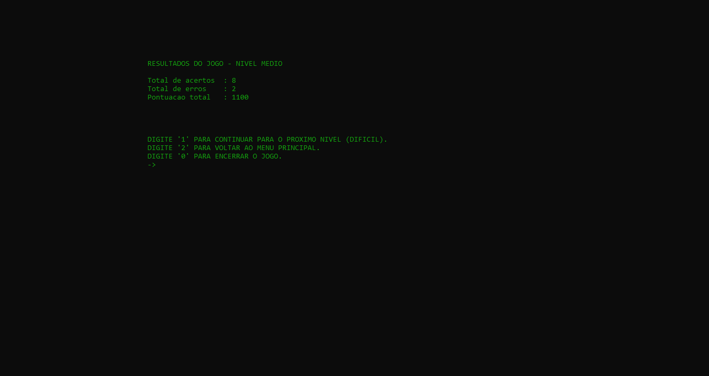

# Quiz Planet - Jogo de perguntas e respostas 🚀
## Descrição
```sh
O Quiz Planet é um jogo de perguntas e respostas com o tema espaço sideral. Desenvolvido em C++ 🚀
```

O jogo possui 3 níveis:
  - 🔰 Fácil
  - 🔰 Médio
  - 🔰 Díficil

Onde o jogador poderá escolher um nível específico ou iniciar do começo, passando por todos os níveis.

O jogador terá:
  - 🔰 10 perguntas em cada nível (Após responder as 10 perguntas, será exibido na tela o resultado do jogador)
  - 🔰 03 erros durante cada nível (Caso o jogador erre mais de 3 perguntas, o jogo será automaticamente encerrado e também será exibido
o resultado na tela)
  - 🔰 02 ajudas dos universitários em cada nível (Caso o jogador tenha dúvida durante alguma pergunta, ele poderá receber até duas dicas dos universitários)

Alguns conceitos que o programa possui:
  - 🔰 LAÇOS DE REPETIÇÃO (for, while, do while);
  - 🔰 ESTRUTURAS CONDICIONAIS (if, else, else if);
  - 🔰 FUNÇÕES (definição, chamada, prototipação, parâmetros);
  - 🔰 CARACTERES ASCII.

## Tela inicial


## Menu


## Regras


## Exemplo de pergunta


## Resultado


## Desenvolvedores: Guilherme Gomes e Jackson Freitas.
### Contato:
Guilherme Gomes<br>
<a href="https://www.linkedin.com/in/guilhermegomees/">LINKEDIN</a>
<br>
<a href="https://www.instagram.com/guilhermehgg/">INSTAGRAM</a>
<br>
<br>
Jackson Freitas<br>
<a href="https://www.linkedin.com/in/jackson-marcelino-de-freitas-900a18209/">LINKEDIN</a>
<br>
<a href="https://www.instagram.com/jacksonm.f/">INSTAGRAM</a>
